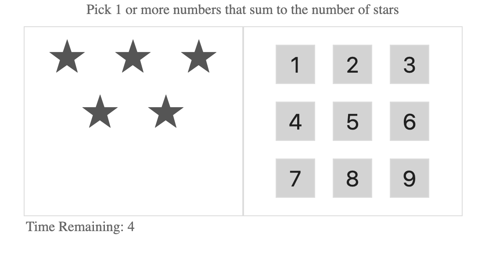
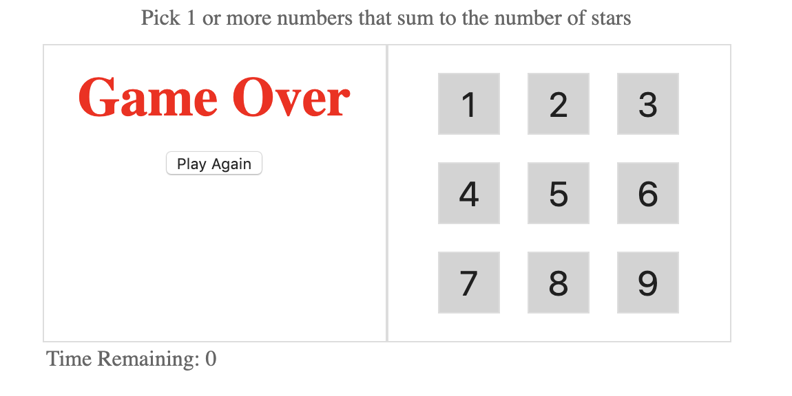
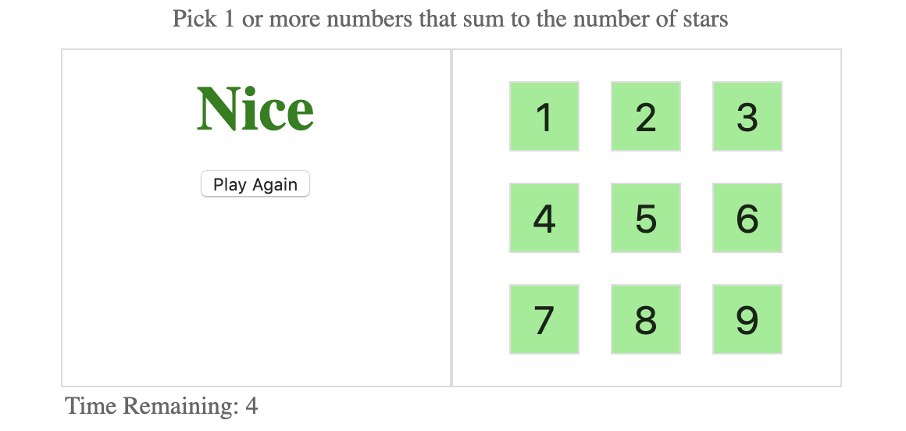

# star-match

Star match game using React

I have created this repository following a pluralsight course for learning react. I have got the inital code from https://jscomplete.com/playground/rgs3.1 and my implementation has followed almost the same pattern within the course. The final game implementation is https://jscomplete.com/playground/rgs3.9.

## Introduction

The game is implementation of star match game where you have to select sum of numbers or number that the total should result in number of starts shown. Follow the game until all of the numbers of used. If you finish the game in n seconds then you will will and loose otherwise.

The start of the game:

Game time over:

Game won:

